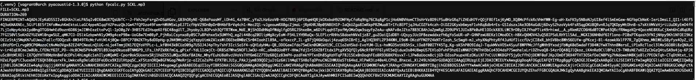

AcoustID
=======

One of the more actively-used open source libraries for audio fingerprinting in the music space.

# Reading, background

**In the Wild**
- Of note, DistroKid's distrolock product [appears to use AcoustID fingerprints](https://support.distrokid.com/hc/en-us/articles/360024829334-What-is-DistroLock), in combination with Audible Magic monitoring service. 
    - Not fully clear whether implication is that Audible Magic uses same fingerprinting protocol

- It is also the primary fingerprinting utility for the MusicBrainz project:
    - https://wiki.musicbrainz.org/Fingerprinting

<br>

**AcoustID project**
- https://acoustid.org
    - https://acoustid.org/chromaprint
        - https://github.com/acoustid/chromaprint
    - https://acoustid.org/webservice

- There is additionally a python utility pyacoustid (which is used here)
    - https://github.com/beetbox/pyacoustid
    - https://pypi.org/project/pyacoustid

**Additional Reading**
- https://oxygene.sk/2011/01/how-does-chromaprint-work
- [Computer Vision for Music Identification, 2005](https://dhoiem.cs.illinois.edu/publications/cvpr2005-mr.pdf)
    - as cited in chromaprint repo, among other projects in the space

**Other Other Reading**
- [Pairwise Boosted Audio Fingerprint (2018)](https://ieeexplore.ieee.org/document/5312768)
- [Efficient Index-Based Audio Matching (2008)](https://ieeexplore.ieee.org/document/4432645)

<br>
<br>

# VM environment (optional)

[Sandbox python environment](https://hackernoon.com/setting-up-a-python-dev-environment-in-2024) as desired. (Optional)


- https://developer.hashicorp.com/vagrant/tutorials/getting-started
    - example `Vagrantfile` included
- See: https://wiki.manjaro.org/index.php/VirtualBox
    - Consult guidance for your given OS


- Spin up machine

```shell
vagrant init
# edit Vagrantfile
vagrant reload
vagrant up # --debug
vagrant ssh
```

- Proivision VM environment (consult `vm-provision.sh`)

<br>
<br>

# Installation
- instructions included for building from source (consult `vm-provision.sh`)
    - https://github.com/acoustid/chromaprint/releases
    - (I encountered build issues between ffmpeg v7 and chromaprint 1.5.1)
- A number of distros also provide chromaprint

<br>
<br>

# Basic Fingerprinting

Fingerprint generation is straightforward, utilizing `fpcalc` utility

```shell
fpcalc audio.mp3
```


<br>

Submitting or checking fingerprints against the acoustid.org database can utilize the available [web services http API](https://acoustid.org/webservice).

```shell
curl https://api.acoustid.org/v2/submit?client=i7pseZuW1Ac&user=XXX&&duration.0=641&fingerprint.0=XXX
```

- Note: API calls require both an application (client) API key as well as a user API key. Both can be obtained via https://acoustid.org

- Further automation around fingerprinting and API calls can be shell scripted, or utilize the `pyacoustid` as below, which includes bindings for both fpcalc and for the acoustid web services.

<br>
<br>


# pyacoustid

https://github.com/beetbox/pyacoustid

**dependencies**
- `chromaprint`
- `python`
- `pip`
- (python venv)

Consult `vm-provision.sh` on installation steps

Scripted fingerprinting and querying functions be then be built utilizing the pythong bindings

```python
import acoustid
for score, recording_id, title, artist in acoustid.match(apikey, path):
# etc
```

```shell
cd pyacoustid-1.3.0
python fpcalc.py audio.mp3
```
