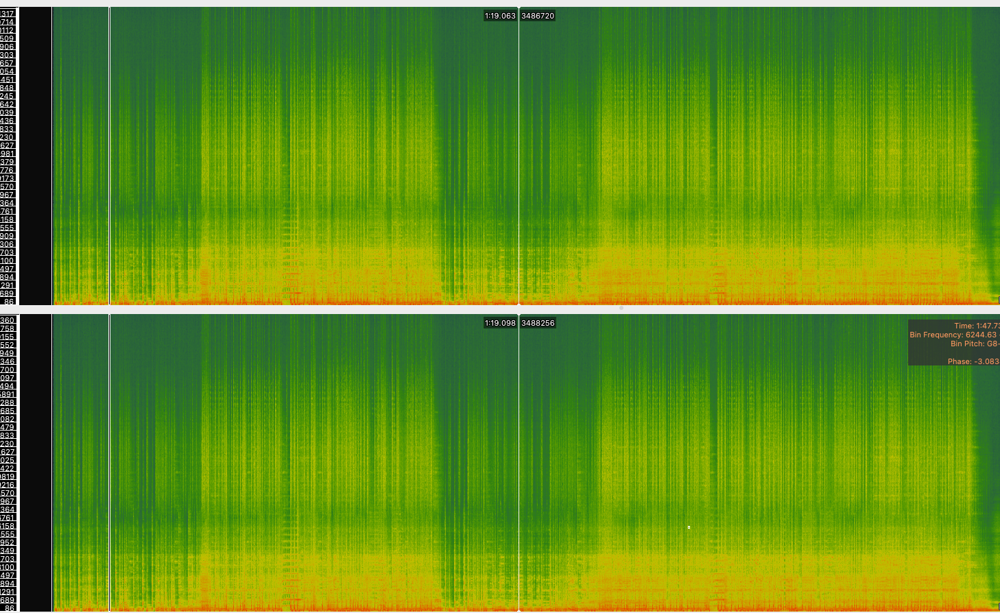

# Audiowmark

- https://uplex.de/audiowmark

- [https://uplex.de/audiowmark/README](https://uplex.de/audiowmark/README.html)

<br>
<br>

# note re: Install (arch)

```shell
pacman -S zstd

wget --show-progress https://github.com/swesterfeld/audiowmark/releases/download/0.6.2/audiowmark-0.6.2.tar.zst

tar --zstd -xvf audiowmark-0.6.2.tar.zst
```

<br>
<br>

# note re: docker build

If planning to use Docker and pulling from stable release repos, will need to revert autogen script back to configure.

```dockerfile
# RUN ./autogen.sh
RUN ./configure
```

```shell
docker build -t audiowmark .
```

<br>
Entrypoint can be removed if desiring a fully interactive shell on the container (i.e. real-time scripting etc inside the box)

<br>

```dockerfile
# ENTRYPOINT ["/usr/local/bin/audiowmark"]
```

```shell
docker build -t audiowmark-i .
docker run -v <local-data-directory>:/data --rm -it
```


<br>
<br>

# note re: supported codecs

AFAIK, only wav is supported. Attempting with .mp3 resulted in a unexpected EOF error:

`audiowmark: warning: unexpected EOF; input frames != output frames`

ffmpeg conversion can resolve quickly for testing purposes, at least with a lossless source audio.

```
ffmpeg -i inputfile.flac output.wav
```

<br>
<br>

# Adding Watermark

```shell
docker run \
-v $AudiowmarkDockerShare:/data \
--rm \
-i audiowmark \
add \
track.wav \
track_wm.wav \
0123456789abcdef0011223344556677
```

TBD whether reasonable expectation to be visibly evident in spectrogram
